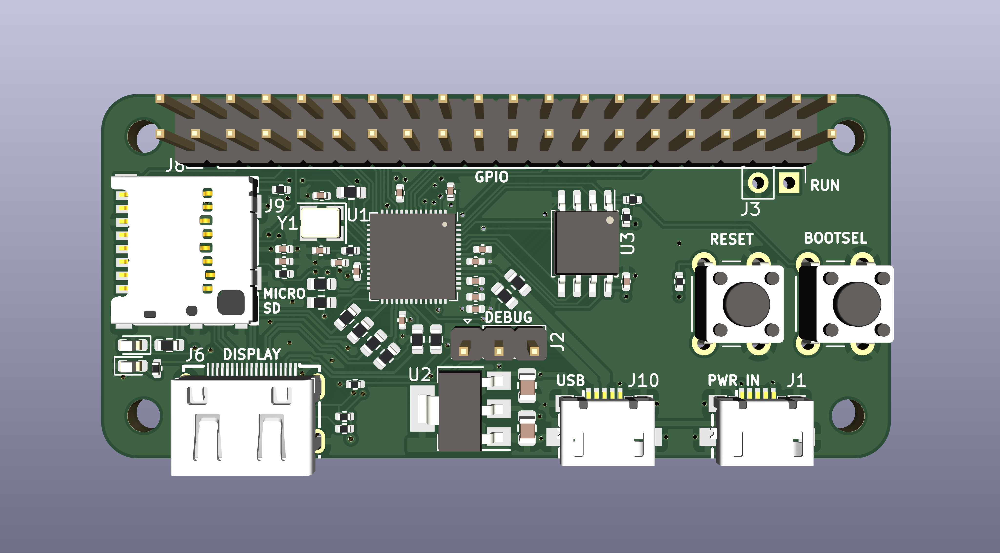

# Faux Pi Zero

An RP2040 microcontroller in a Raspberry Pi Zero form factor.

## Notes

* [SPI and SD cards](https://electronics.stackexchange.com/questions/602105/how-can-i-initialize-use-sd-cards-with-spi)