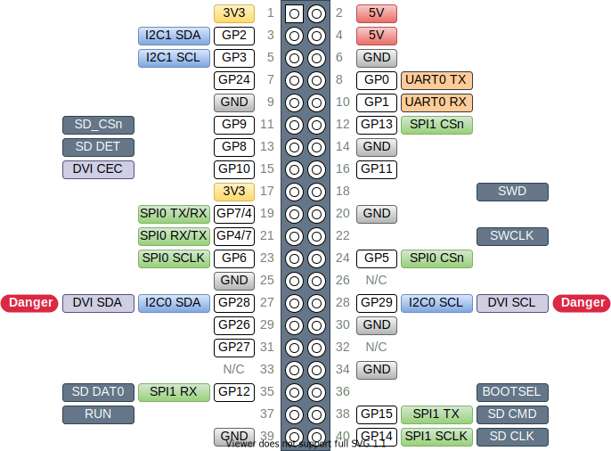

# Faux Pi Zero

RP2040 dev board in a Raspberry Pi Zero compatible form factor.  Includes Mini HDMI (via [bitbanged DVI](https://github.com/Wren6991/PicoDVI)) and microSD.

## Description

This board aids with migrating a project from the Pi Zero to the RP2040 while retaining the option of moving back to the Pi Zero in the future.  It has the same footprint as the Pi Zero and a partially compatible [pinout](#pinout), making it convenient to support both the RP2040 and Pi Zero in the same design.

## Status

Untested.  Currently awaiting first test boards from JLCPCB.

## Features

* Compatible footprint:
  * Mini HDMI (via [bitbanged DVI](https://github.com/Wren6991/PicoDVI))
  * Micro SD (via SPI mode.  Cards must be <2TB)
  * Micro USB
  * Power (via Micro USB)
* Partially compatible [pinout](#pinout)
* 16MB Flash
* Green status LED on GP25 (same as Pico)
* Red SD activity LED on GP9
* BOOTSEL and RESET buttons
* SWD Header

## Pinout

See [schematic](#schematic) for more details.

### Mapping from Pi Zero to Faux Px Zero

Pi Pin | Pico Pin | Pi GPIO | Pico GP | Function | Notes
-|-|-|-|-|-
1, 17 | 36 |  | 3V3 (Out) |  |
2, 4 | 39 |  | VSYS |  |
2, 4 | 40 |  | VBUS |  |
3 | 4 | GPIO 02 | GP 02 | I2C_SDA |
5 | 5 | GPIO 03 | GP 03 | I2C_SCL |
6, 9, 14, 20, 25, 30, 34, 39 | 3, 8, 13, 18, 23, 28, 33, 38, DBG-2 |  | GND |  |
7 |  | GPIO 04 | GP 24 |  |
8 | 1 | GPIO 14 | GP 00 | UART0 TX |
10 | 2 | GPIO 15 | GP 01 | UART0 RX |
11 | 12 | GPIO 17 | GP 09 | SD_CSn | Can be used as GP with SD card removed.  Note 10k pullup.
12 | 17 | GPIO 18 | GP 13 | SPI1_CSn | Can be used to share SPI1 with SD card.
13 | 11 | GPIO 27 | GP 08 | SD_DET | Can be used as GP with SD card removed.
15 | 14 | GPIO 22 | GP 10 | DVI_CEC | DVI_CEC when JP3 closed.  See [schematic](#schematic).
16 | 15 | GPIO 23 | GP 11 |  |
18 | DBG-3 | GPIO 24 | SWD |  |
19 | 6/10 | GPIO 10 | GP 04/07 | SPI0_RX/TX | Select [controller](https://www.oshwa.org/a-resolution-to-redefine-spi-signal-names/) or [peripheral](https://www.oshwa.org/a-resolution-to-redefine-spi-signal-names/) via JP1 and JP2.  See [schematic](#schematic).
21 | 10/6 | GPIO 09 | GP 07/04 | SPI0_TX/RX | Select [controller](https://www.oshwa.org/a-resolution-to-redefine-spi-signal-names/) or [peripheral](https://www.oshwa.org/a-resolution-to-redefine-spi-signal-names/) via JP1 and JP2.  See [schematic](#schematic).
22 | DBG-1 | GPIO 25 | SWCLK |  |
23 | 9 | GPIO 11 | GP 06 | SPI0_SCLK |
24 | 7 | GPIO 08 | GP 05 | SPI0_CSn |
26 |  | GPIO 07 |  |  |
27 | 34 | GPIO 00 | GP 28 | I2C_SCL | DVI_SDA when JP4 closed.  See [schematic](#schematic).
28 |  | GPIO 01 | GP 29 |  |
29 | 31 | GPIO 05 | GP 26 |  |
31 | 32 | GPIO 06 | GP 27 | I2C_SDA | DVI_SDA when JP5 closed.  See [schematic](#schematic).
32 |  | GPIO 12 |  |  |
33 |  | GPIO 13 |  |  |
35 | 16 | GPIO 19 | GP 12 | SPI1_RX / SD_DAT | Can be used as GP with SD card removed.  Note 10k pullup.
36 |  | GPIO 16 | BOOTSEL |  |
37 | 30 | GPIO 26 | RUN |  |
38 | 20 | GPIO 20 | GP 15 | SPI1_TX / SD_CMD | Can be used as GP with SD card removed.
40 | 19 | GPIO 21 | GP 14 | SPI1_SCLK / SD_CLK | Can be used as GP with SD card removed.
   |    |    | GP 23 | DVI_D2+ |
   |    | 21 | GP 16 | DVI_CK- |
   |    | 22 | GP 17 | DVI_CK+ |
   |    | 24 | GP 18 | DVI_D0- |
   |    | 25 | GP 19 | DVI_D0+ |
   |    | 26 | GP 20 | DVI_D1- |
   |    | 27 | GP 21 | DVI_D1+ |
   |    | 29 | GP 22 | DVI_D2- |
   | 35 |  | N/C |  |
   | 37 |  | 3V3_EN |  |
   | LED |  | GP 25 |  |

## Schematic

(Click image to view PDF)

